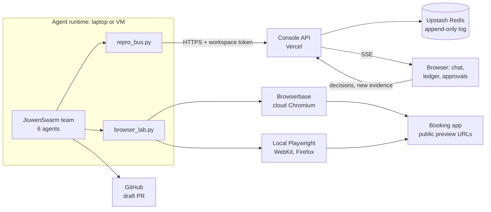
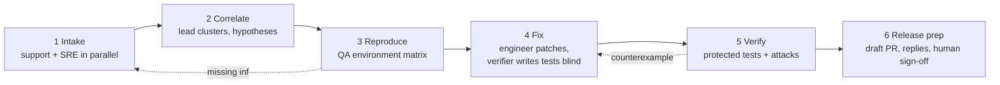

# Repro: build briefing for Hack the North 2026

As of 2026-09-19

## What this is

This brief gives a coding model everything it needs to finish Repro at Hack the North 2026 without re-deriving decisions already made. Paste it whole as the first message, attach `repro-console.zip` (or point the model at the `repro-console/` folder next to this file), then give one task at a time from the build order.

Repro turns messy customer complaints into verified bug fixes. A team of six agents takes contradictory support tickets, screenshots, incomplete logs and a codebase. It works out what is actually broken, reproduces it in real browsers, and opens a draft pull request with a tested fix. The agents settle disagreements by running experiments against the application, never by voting on which explanation sounds plausible.

The pitch line: "Your customers describe symptoms. Repro reconstructs what happened, tests competing explanations, and delivers a fix with evidence."

The two prizes the project was designed for are Rox (agents on messy data that take real actions) and Huawei (genuine multi-agent collaboration). Every other sponsor in this brief is secondary. When a secondary integration costs more than two hours or bends the product, cut it.

## Prize map

Five of the eleven selected prizes fit Repro without bending it, three are bolt-ons, and three are separate projects that should not touch this codebase. Requirements below are from the [Hack the North 2026 Devpost page](https://hackthenorth2026.devpost.com/) and sponsor pages, read on 19 Sep 2026.

Two event rules shape everything. Sponsor prizes must be selected before 2:00 PM EDT on Saturday. The judging pitch must be a live demo, not a slide deck.

### Natural fits: build for these

| Prize | What it actually asks for | How Repro meets it | Work left |
| --- | --- | --- | --- |
| Rox: Best AI Agent ($10K / $2K) | LLM agents on messy real-world data (unstructured, incomplete, conflicting, noisy) that take meaningful actions. Show data validation, multi-source resolution, error handling, decisions under uncertainty. Judged on complexity, creativity, handling of messiness, utility. | Contradictory tickets, logs with missing correlation IDs, a wrong internal note. Evidence ledger keeps disagreement. Actions: draft PR, ticket updates, reply drafts. | The messy fixtures and the agent runtime do not exist yet. This is the critical path. |
| Huawei: openJiuwen Multi-Agent | A working multi-agent app with genuine collaboration: task decomposition, communication, tool use, coordination. Not chained prompts. JiuwenSwarm or WorkSwarm encouraged, not required. Judged on collaboration quality, creativity, demo completeness, implementation, reusability. Up to $40 API credits per team. | Six roles, peer-to-peer messages, rejected-fix loop, blind acceptance tests, server-enforced separation of duties. | Nothing runs on JiuwenSwarm yet. Wire the team to it or lose the easiest points. |
| Browserbase: Best Use | The listing says only: submit the project with the best use of Browserbase. | Environment matrix: same repro steps in clean cloud Chromium vs local WebKit and Firefox, attribution verdict, live view embedded in the console. | `browser_lab.py` has never run against a real account. Test it first. |
| MLH: Best Use of Gemini API (swag) | Use the Gemini API in the project. | QA engineer on Gemini 3.1 Pro, support engineer on Gemini 3.8 Flash reading screenshots. | None beyond using the real API. |
| MLH: Best Domain Name (gift card) | Register a domain through GoDaddy Registry. | Ten minutes. Point it at the Vercel deployment. | Pick the name first. |

### Eligible with honest effort

| Prize | What it actually asks for | Honest assessment |
| --- | --- | --- |
| OpenAI: API Prizes | Two things, both judged: what the OpenAI API powers in the product, and how Codex helped you build it. In the demo, explain the API use and give one concrete way Codex improved the process. | The release verifier runs on an OpenAI model, so the API gates every fix. That is real but it is one agent of six. The Codex half is only true if Codex actually builds part of this. If the stronger model receiving this brief is Codex, keep `CODEX_LOG.md` with dated entries: task, what it produced, what it caught. If Codex is not used, deselect this prize. |
| Cognition: Best Use of Devin | Criteria not found online. Ask at the booth before building anything. | The natural slot is the software-engineer agent: call the Devin API with the failing test and hypothesis, let it open the PR, and keep the independent verifier. Risk: Devin sessions take minutes, which is slow for a live demo. Build it as a switch (`FIXER_BACKEND=devin` or `llm`) so the demo never depends on it. |

### Flagged: forced or costly

| Prize | What it asks for | Why it is flagged | If you do it anyway |
| --- | --- | --- | --- |
| Cloudflare: Best Agent with a Brain ($50K credits) | Workers must be a meaningful part of the runtime, backend or orchestration. Pages alone does not qualify. Judged on agent capability, Workers usage, execution, creativity, usefulness. [Details](https://hack-the-north-cloudflare-prize.devrel.workers.dev/) | Technically a good match: one Durable Object per run holding the event log, with WebSockets, is a better bus than Vercel functions polling Redis. But it is a backend rewrite and it contradicts the decision to deploy on Vercel. Putting a token Worker in front of Vercel would not qualify and would look like it. | Move only the bus to a Worker plus Durable Object: ingest, rule enforcement, log, live stream. Keep the Next.js UI on Vercel. Budget 3 to 4 hours. Do it only after the core demo works end to end. |
| Solana: Best Use of Solana ($5K) | Build something creative with Solana; surprise the judges. | Strange inclusion. Nothing in bug triage needs a blockchain. The one defensible use is notarising the audit record: write the SHA-256 of the run export and of each human approval to devnet with the Memo program, so nobody who controls the database can rewrite history. Judges have seen hash-anchoring many times. | 1 to 2 hours, last in the build order. One sentence in the demo, no more. Never put tickets, names or code on chain. |

### Separate projects: keep out of this codebase

| Prize | What it is | Note |
| --- | --- | --- |
| Dryft Company Challenge ($2,000) | Make a supplied autoregressive transformer generate tokens as fast as possible on H100s, correctness-tested, hidden workloads. [htn.dryft.ai](https://htn.dryft.ai) | Unrelated to Repro. Its own repo and its own person. |
| Dominion Dynamics: WHITEOUT | Write fleet coordination for aircraft, quadcopters, rovers and towers in a live Arctic simulation (ArduPilot, MAVLink). Scored live. | Unrelated. Also a full project on its own. Two side challenges plus Repro is too much for a team of four. |
| Badge Hack ($2,500, same checkbox as Solana) | Build something on or with the Hack the North badge. It need not relate to the main project. | The Doom badge idea belongs here. Ask organisers whether it rides on the Repro submission or needs its own. |

### Not selected, but a better fit than half the list

| Prize | Requirement | Why add it |
| --- | --- | --- |
| Warp: Best Developer Tool (keyboards) | No API requirement. Improve any part of the development lifecycle. Judged on wow, difficulty, originality, design. | Repro is a developer tool. Zero extra work. |
| Sentry: Best Use of Sentry (guaranteed interviews) | Use at least two products beyond error monitoring (Session Replay, Logs, Tracing, Profiling, Uptime, MCP/agent monitoring), and show how the data shaped the project. | Instrument the booking app. Tracing shows two POST spans from one click; Session Replay shows the single click. The SRE analyst reads both. It makes the messy-data story stronger, about 2 hours. |
| Elastic: Find the Signal (Quest 3S / Bose) | Messy unstructured data, agents that retrieve and act, beyond RAG chat: hybrid search, ES\|QL, aggregations. | Plausible home for tickets and logs, but 2 to 3 hours and it duplicates Sentry's role. Only if someone is idle. |

## Architecture

Four pieces run in three places: the agents and their browsers run on a laptop or VM, the console runs on Vercel, and the app under test runs as its own public deployment.

The agents never run on Vercel. They need a long-lived process, a browser and the sandbox; Vercel functions live about a minute. The console is the control plane: ingest, rule enforcement, storage, live view, human sign-off, audit export.

| Piece | Runs on | Stack | Notes |
| --- | --- | --- | --- |
| Console | Vercel | Next.js 15 App Router, plain JS, plain CSS, `@upstash/redis` | In the zip. Falls back to process memory with no Redis, which only works locally. |
| Event log | Upstash Redis | One list per run; `seq` is the list position | Append-only. Rejected writes are logged too. |
| Agent runtime | Laptop or VM | Python, JiuwenSwarm, `repro_bus.py`, `browser_lab.py` | Bus and lab exist. The team wiring does not. |
| Cloud browsers | Browserbase | Python SDK, Playwright over CDP | Chromium only. Cannot reach localhost. |
| Booking app | Its own Vercel project | Anything small with a real database | Does not exist. `main` carries the seeded bug; the fix branch gets its own preview URL. |

Live updates use server-sent events. Each connection lasts about 50 seconds, then the browser reconnects and resumes from `Last-Event-ID`. People talk back through `POST /api/runs/:id/human`; the runtime polls `GET /api/runs/:id/events?human=1`.

Secrets stay where they are used. Browserbase, GitHub and model keys live only in the runtime. The console holds Redis credentials, two dashboard passwords, a session secret and the ingest tokens.

## Agent team

Six agents mirror how a real engineering organisation takes a complaint to a fix, and the rule that holds it together is that proposers and checkers never share a model family. Full prompts are in `team/agents/*.md`; do not rewrite them, wire them.

| Agent | Real-world role | Model | Only this agent can |
| --- | --- | --- | --- |
| `incident-lead` (Leader) | Incident commander | Claude Opus 5 | Write incidents and hypotheses, move the stage. Cannot produce evidence or override a verdict. |
| `support-engineer` | Tier-2 support | Gemini 3.8 Flash | Write claims from tickets and screenshots; draft customer replies. |
| `sre-analyst` | Observability engineer | DeepSeek V4.1 Flash | Write claims from logs, database and deploy history. Read-only everywhere. |
| `qa-engineer` | SDET | Gemini 3.1 Pro | Run experiments and browsers; move a claim from reported to observed. |
| `software-engineer` | On-call developer | Claude Sonnet 5 | Write patches on a `fix/*` branch. Cannot touch any test directory. |
| `release-verifier` | Reviewer plus QA sign-off | GPT-5.6 Sol | Write protected tests and the verdict. |

Model names were checked against public rankings, not provider docs. Confirm exact API ids before wiring. Keep three separations if any model changes: engineer and verifier differ, QA and verifier differ, support and SRE differ.

Gates are enforced in code. No fix stage without a regression test that fails on `main`. No verify stage if the diff touches `tests/`. No release prep without a verdict that records fails-on-base, passes-on-branch and a green suite.

### Bus rules the console already enforces

- A message with empty `refs` is refused, except `BLOCKED_INFRA`.
- The ledger permission table above is checked on every write. QA may change only a claim's status, and only with experiment evidence.
- A `verified` verdict must carry its three test results.
- Only `incident-lead` moves the stage. A move to an earlier stage renders as "Sent back".
- Browser events are accepted only from `qa-engineer` and `release-verifier`.
- Refused writes are appended to the log as `REJECTED` and shown in the room.
- Tool and browser failures are infrastructure. They never change the ledger.

### Behaviours the demo must show

1. Disagreement is settled by execution. A `CHALLENGE` must carry a proposed experiment.
2. Internal notes such as "fixed last week" are claims with status reported, never facts.
3. Two confirmation emails are not two reservations. `INC-2` stays separate from `INC-1`.
4. The first patch is rejected with a failing test, not an opinion, and the pipeline moves back a stage.
5. "Not reproduced" is never "not a bug". Missing fields are named and sent to support.

Ledger record shapes are in `team/ledger_schema.json`. Event shapes are in `lib/validate.js`. Message types: `TASK`, `HANDOFF`, `EXPERIMENT_REQUEST`, `EXPERIMENT_RESULT`, `INFO_REQUEST`, `INFO_RESPONSE`, `CHALLENGE`, `COUNTEREXAMPLE`, `VERDICT`, `BLOCKED_INFRA`, `APPROVAL_REQUEST`, `NEW_EVIDENCE`, `NOTE`.

## State of the code

The console and the agent-side plumbing exist; the thing being demonstrated does not. There is no booking app, no ticket fixtures, no orchestrator, and no agent has ever called a model.

### Exists in `repro-console/`

| Path | What it is | Verified how |
| --- | --- | --- |
| `app/`, `components/RunRoom.jsx`, `app/globals.css` | Console UI: run list, login, live room with chat, roster, pipeline rail, ledger tabs, Browsers tab, approvals, composer | Syntax-checked; room rendered statically from the fixture and screenshotted. Never built with `next build`. |
| `app/api/**` | Runs, event ingest, SSE stream, human input, audit export, simulated replay | Route handlers exercised in memory mode with sign-in off: bad token 401, cross-workspace 403, forbidden writes refused, double decision 409, stream resumes. |
| `lib/validate.js`, `lib/reduce.js`, `lib/agents.js` | Bus rules, event folding, team definition and model labels | Fixture of 64 events passes validation; refusal cases tested. |
| `lib/auth.js`, `middleware.js` | Two shared passwords, signed session cookie, per-workspace ingest tokens | Cookie path and redirect never exercised. |
| `lib/demoTrace.js` | Scripted replay of the double-booking investigation, marked simulated everywhere | Runs through the same validator as real events. |
| `worker/repro_bus.py` | Python client: message, ledger, stage, tool, browser, approvals, human polling | Parsed only. Never run against a deployed console. |
| `worker/browser_lab.py` | Environment matrix, fault injection, attribution | Attribution logic unit-tested on five cases. Browserbase and Playwright paths never run. |
| `team/` | Six agent prompts, team design, ledger schema, model assignment | Documents. |

### Missing, in order of importance

1. **Booking app with the seeded bug.** Server creates a reservation, the response is lost, the client's fetch wrapper retries, the server creates a second one. Needs sandbox endpoints for reset and for reading reservations by account, a request log with some missing correlation IDs, and last week's "fix" that only disabled the button.
2. **Messy fixtures.** About 18 tickets, 3 screenshots, a log export. Must include one reproducible defect, one look-alike that is not a defect (two emails, one reservation), and one case with too little evidence. Have teammates who know the symptoms but not the cause write some tickets. Label synthetic data as synthetic.
3. **The orchestrator.** A JiuwenSwarm team with `incident-lead` as Leader and five teammates, each with its prompt, model and tools. Tools are thin wrappers over `ReproBus` and `BrowserLab`, plus ticket read, log query, repo read, git branch, test run, and draft PR.
4. **Hard gates in the runtime.** A git hook or path check that blocks the engineer from `tests/`; a check that the regression test fails on `main` before the fix stage opens.
5. **Single-agent baseline.** Same model budget and tools, one agent. Needed for the comparison numbers.
6. **GitHub draft PR creation** behind human approval.

### Known defects and debts in what exists

- Sign-in is two shared passwords plus a typed name. Not SSO. Every signed-in person sees every workspace.
- Each open room polls Redis about once a second. Fine for a demo.
- Artifacts are shown as paths, not links.
- The project is still called Repro. "Gander" was proposed and not decided. Rename only if the team says so.

## Sponsor integration specs

Each integration below is specified so that the sponsor's technology does a job the product needs; where it does not, the spec says so and keeps it behind a switch.

### JiuwenSwarm (Huawei)

- Install with `pip install jiuwenswarm`, then `jiuwenswarm-init` and `jiuwenswarm-start`. Team mode is `/mode team`. [Repo](https://github.com/openJiuwen-ai/jiuwenswarm), [Agent Team guide](https://github.com/openJiuwen-ai/jiuwenswarm/blob/develop/docs/en/AgentTeam.md).
- The model is Leader plus teammates, a shared `team-workspace/artifacts/` folder, task dependencies, messaging, and event-driven progression. Each member has an `AGENT.md` in its workspace.
- Map stage gates to task dependencies. Map backward edges to the Leader creating a new task from a `COUNTEREXAMPLE` or `INFO_REQUEST`.
- Use team-level skill `deny` to enforce the permission table: deny git write to everyone but the engineer, deny browser tools to everyone but QA and the verifier.
- Use a persistent team so `TEAM_MEMORY.md` accumulates lessons across incidents. That is the reusability story.
- Open question: the docs show one default model in `config.yaml`. Whether each member can use a different model was not confirmed. Ask at the Huawei booth. JiuwenSwarm accepts OpenAI-compatible endpoints and OpenRouter, which gives one key for all providers.
- Agents must talk through `ReproBus.message`, not only JiuwenSwarm's internal chat, or the console will not show the conversation.

### Browserbase

- Python: `bb.sessions.create(project_id=..., browser_settings={...})`, then `playwright.chromium.connect_over_cdp(session.connect_url)`. Live view: `bb.sessions.debug(session.id).debugger_fullscreen_url`. Recording: `https://www.browserbase.com/sessions/<id>`. [SDK reference](https://docs.browserbase.com/reference/sdk/python), [live view guide](https://docs.browserbase.com/guides/integrate-live-session).
- Useful per-session settings: `viewport`, `blockAds`, `extensionId`, `context`, `region`, `proxies` with geolocation. `os` needs advanced stealth.
- Sessions are Chromium. Safari-engine and Firefox checks run in local Playwright. Say "Safari engine, emulated" in anything customer-facing.
- A cloud browser cannot open localhost. The booking app must be public, with preview protection off or a bypass token.
- `drop_response` lets the server process the request and then aborts the reply, for the first N matching requests only, so the client's retry gets through.
- The console embeds only URLs on browserbase.com, view-only.

### Gemini and OpenAI

- Gemini: QA and support agents call the Gemini API directly or through the router. Support sends screenshots as images in the same request as ticket text.
- OpenAI: the verifier calls an OpenAI model. For the prize, the demo must state what the API powers and one concrete way Codex helped. Keep `CODEX_LOG.md` from the first Codex task.

### Sentry (if added)

- Instrument the booking app, not the console. Turn on Tracing, Logs and Session Replay.
- Give `sre-analyst` a Sentry read tool (API or Sentry's MCP server). The target finding: one click in the replay, two `POST /bookings` spans in the trace, no error event.
- The prize asks how the data shaped the project. Record the moment it changed a hypothesis.

### Devin (behind a switch)

- `FIXER_BACKEND=devin` sends the failing test, hypothesis and repo to the Devin API and waits for a PR. `llm` uses the normal engineer agent.
- The verifier stays independent in both modes. Do not let Devin write or edit protected tests.
- Confirm judging criteria at the Cognition booth first.

### Cloudflare (only if chosen)

- One Durable Object per run holds the event log and serves WebSocket subscribers. A Worker fronts it: token check, `validateWorkerEvent` ported as-is, append, broadcast. [Agents SDK](https://agents.cloudflare.com/).
- The Next.js UI stays on Vercel and swaps `EventSource` for a WebSocket. Human input posts to the Worker.
- Workers alone must carry the orchestration for this to qualify. A proxy in front of Vercel does not.

### Solana (last, optional)

- On `RUN_FINISHED` and on every human decision, compute SHA-256 of the canonical JSON and send it in a Memo-program transaction on devnet. Store the signature as a `system` event and link the explorer.
- Hashes only. No ticket text, names, emails or code on chain.

### GoDaddy Registry

- Register the domain, add it to the Vercel project, and use it in the demo and the Devpost entry.

## Build order

Build the thing being demonstrated before any more scaffolding: the first real end-to-end run is the milestone, and everything after it is optional. Give the builder model one numbered task at a time. Hours are estimates for one person.

| # | Task | Done when | Hours | Prizes served |
| --- | --- | --- | --- | --- |
| 1 | Deploy the console to Vercel with Redis and the env vars. Fix whatever `next build` complains about. Run `worker/example_run.py` against it. | A forbidden write is refused in the room and an approval in the browser unblocks the script. | 1 | all |
| 2 | Booking app with the seeded bug, sandbox reset and read endpoints, request log. Own Vercel project, preview per branch, protection off. | One click on a clean network gives one reservation; with the response dropped it gives two. | 3 | Rox, Browserbase |
| 3 | Run `worker/example_browser_matrix.py` against the booking app with real Browserbase keys. Fix SDK mismatches. | Matrix returns `website_defect_network_trigger` and the live view shows in the Browsers tab. | 1.5 | Browserbase |
| 4 | Fixtures: tickets, screenshots, log export, the wrong internal note. | Hand count of expected claims and incidents written down for scoring. | 1.5 | Rox |
| 5 | JiuwenSwarm team: six members, prompts, models, tools over `ReproBus` and `BrowserLab`. Intake through Reproduce first. | A real run reaches stage 3 with claims, two incidents and a supported hypothesis, visible live. | 4 | Huawei, Rox, Gemini |
| 6 | Fix and Verify: branch-only git tool, `tests/` path block, blind protected tests, verdict, counterexample loop, max three rounds. | A client-only patch is rejected with a failing test; a server-side patch is verified. | 3 | Huawei, OpenAI |
| 7 | Release prep: draft PR on GitHub, ticket updates, reply drafts, all behind console approval. | Approving in the browser opens the draft PR. | 1.5 | Rox |
| 8 | New-evidence path: a message typed in the room makes the lead re-cluster and say whether the conclusion changes. | A judge's contradictory ticket is handled live. | 1 | Rox, Huawei |
| 9 | Single-agent baseline and the four metrics. | Numbers shown in the console or README. | 1.5 | Rox |

**Cut line.** Everything above is the project. Everything below is optional and ordered by value per hour.

| # | Task | Hours | Prize |
| --- | --- | --- | --- |
| 10 | Domain from GoDaddy Registry, pointed at the console | 0.25 | GoDaddy |
| 11 | Sentry on the booking app; Sentry read tool for the SRE analyst | 2 | Sentry |
| 12 | `FIXER_BACKEND=devin` switch | 1.5 | Cognition |
| 13 | Bus on a Cloudflare Worker plus Durable Object | 3 to 4 | Cloudflare |
| 14 | Audit hashes on Solana devnet | 1 to 2 | Solana |

If time runs short inside the core, cut in this order: baseline (9), draft PR automation (7, show the diff instead), then fold the SRE analyst into the support engineer. Never cut the separate verifier.

## Demo and evidence

The demo is a live run in the console, because Hack the North judges want a working demo and both target sponsors want proof it survives mess. Aim for four minutes.

1. Show the inbox: "I pressed Book once and have two reservations", "only on my phone", the colleague's note "fixed last week, probably user error", clean-looking logs.
2. Give the one instruction: investigate these complaints and open a reviewable fix for any confirmed defect.
3. Let the room run. Point at three moments: the two-emails ticket kept out of the main incident; the environment matrix failing in a clean cloud browser, so it is the website, not the phone; the first patch sent back with a failing test.
4. Open the Browsers tab while a Browserbase session is live.
5. Invite a judge to type a contradictory report into the room. The lead must revise its conclusion or show why the new evidence does not change it.
6. Approve the draft PR from the browser. Show it on GitHub. Download the audit record.

Never pass the simulated replay off as a real run. It is labelled in the UI; use it only as a fallback if the network dies, and say so.

| Metric | How to measure | Why it matters |
| --- | --- | --- |
| Confirmed-defect accuracy | Incidents marked confirmed versus the hand-labelled truth | Rox: decisions under uncertainty |
| False merges | Tickets placed in the wrong incident | Rox: multi-source resolution |
| Patches passing protected tests | First-attempt and final, over several runs | Huawei: verification works |
| Unsupported "resolved" claims | Any verified or fix-deployed statement with no verdict behind it; target zero | Both |
| Team versus single agent | Same models, tools and token budget | Huawei: collaboration earns its cost |

Show these in the README or a console page, not on slides.

## Risks, unknowns and rules for the builder

The largest risk is spreading across eleven prizes and finishing none; the second is that three external integrations have never been run. Settle the unknowns below before writing code that depends on them.

### Unverified, check first

| Unknown | Why it matters | How to settle it |
| --- | --- | --- |
| Per-agent models in JiuwenSwarm | The whole model assignment depends on it | Huawei booth, or read `docs/en/Configuration.md`. Fallback: one OpenRouter key, or call models from inside each agent's tools. |
| What the $40 Huawei credits can be spent on | Decides which models are affordable | Huawei booth |
| Exact API model ids and prices | Names here came from ranking sites | Each provider's docs |
| Browserbase SDK details and plan limits | `browser_lab.py` was written from docs | Task 3. Default matrix opens 12 cloud sessions per experiment; drop `runs` to 2 if needed. |
| Cognition judging criteria | Not published where we could find them | Cognition booth |
| Whether side challenges and the badge hack need their own submissions | Affects what to tick on Devpost | Organisers |
| `next build` on Next.js 15 with React 19 | Never run | Task 1 |

### Rules for the model doing the build

1. Read `README.md`, `team/TEAM.md` and `lib/validate.js` before changing anything. The event contract lives in `validate.js`; extend it there, never around it.
2. Enforce rules in code, on the server or in the runtime. A rule that lives only in a prompt does not count.
3. Agent messages in the demo must come from real tool runs. Do not script dialogue. The simulated replay stays separate and labelled.
4. Tool, browser and network failures are infrastructure. They raise `BLOCKED_INFRA` and never become evidence.
5. Keep merge, deploy and customer sends behind human approval. Draft PRs and reply drafts only.
6. No customer names or emails in events. Account and ticket ids only.
7. Keys stay in the runtime. Nothing secret goes to the browser or into an event.
8. Say what you ran and what you did not. If something is untested, write that next to it.
9. Prefer small diffs to the existing console. It is plain JavaScript and plain CSS on purpose; do not add a framework to it.
10. When a sponsor integration conflicts with the core demo, the core demo wins.

### Sources

- [Hack the North 2026 on Devpost](https://hackthenorth2026.devpost.com/): rules, judging, sponsor prize text
- [Cloudflare: Best Agent with a Brain](https://hack-the-north-cloudflare-prize.devrel.workers.dev/)
- [JiuwenSwarm repository](https://github.com/openJiuwen-ai/jiuwenswarm) and [Agent Team guide](https://github.com/openJiuwen-ai/jiuwenswarm/blob/develop/docs/en/AgentTeam.md)
- [Browserbase Python SDK](https://docs.browserbase.com/reference/sdk/python), [live view](https://docs.browserbase.com/guides/integrate-live-session), [session recording](https://docs.browserbase.com/platform/browser/observability/session-recording)
- [Hack the North project museum](https://museum.hackthenorth.com): what past finalists looked like
